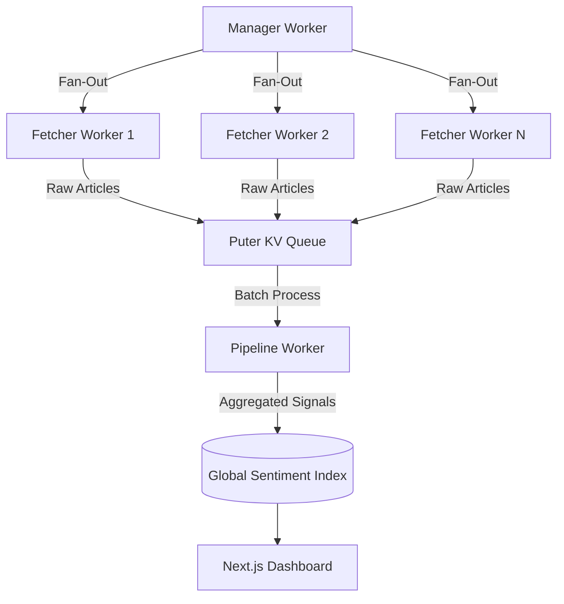
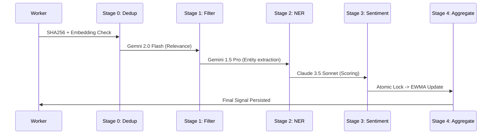

# Sentiment Liquidity Engine (RTF)

[](https://nextjs.org/)
[](https://www.typescriptlang.org/)
[](https://puter.com/)
[](LICENSE)

**Sentiment Liquidity Engine (RTF)** is a high-throughput, real-time financial intelligence platform. It ingests 100+ global news feeds, runs a multi-model AI pipeline to extract ticker-mapped sentiment signals, and visualizes a live "Sentiment Liquidity Index" for quantitative traders and analysts.

The system is built on a **True Zero-Cost Serverless Architecture** using the Puter.js SDK, delegating all compute and inference costs to the authenticated user.

---

## 🚀 Key Engineering Highlights

- **Multi-Model AI Orchestration**: Leverages **Gemini 2.0 Flash** (relevance), **Gemini 1.5 Pro** (NER/Disambiguation), and **Claude 3.5 Sonnet** (Sentiment) for peak accuracy and cost-efficiency.
- **Distributed Atomic Locking**: Uses serverless `kv.incr()` atomic operations to manage race conditions during high-concurrency EWMA (Exponential Weighted Moving Average) updates.
- **Semantic Deduplication**: Implements a two-pass dedup logic using SHA256 hashes and **Vector Embeddings** (cosine similarity) to filter out redundant news across 100+ sources.
- **Circuit Breaker & Resilience**: Per-source circuit breakers and exponential backoff with jitter protect the pipeline from unstable feeds and rate limits.
- **User-Pays Infrastructure**: An ingenious architectural pattern where 100% of compute, storage, and AI inference costs are billed to the end-user's Puter account, enabling infinite scale at zero cost to the developer.

---

## 🏗️ System Architecture

### Worker Fan-Out Pattern
The system utilizes a distributed worker architecture to handle high-throughput data ingestion and processing.



### Multi-Stage AI Pipeline
Each article undergoes a 6-stage transformation process to extract high-fidelity financial signals.



---

## 🛠️ Technical Deep Dive

### 1. Atomic Distributed Locking
To prevent race conditions when multiple workers update the same ticker's score simultaneously, we implement a semaphore using `puter.kv.incr()`.
```typescript
// lib/resilience/lock.ts
export async function acquireLock(ticker: string): Promise<boolean> {
    const key = `lock:${ticker}`;
    const count = await kvIncrement(key); // Atomic server-side increment
    if (count === 1) return true; // Lock acquired
    await kvDecrement(key); // Back off
    return false;
}
```

### 2. Semantic Deduplication with Decreasing Timestamps
We utilize `puter.ai.embed()` to calculate cosine similarity between articles. To optimize `kv.list()` lookups, we use a **decreasing timestamp prefix** (`MAX_INT - current_ts`), ensuring newest articles are sorted first lexicographically for O(1) recent window access.

### 3. Circuit Breaker Resilience
Individual data sources are monitored for health. After 5 consecutive failures, the source is "tripped" for 15 minutes, preventing resource waste on dead or rate-limited endpoints.

---

## 🎨 Frontend: The Trading Terminal Aesthetic

The UI is inspired by professional quantitative terminals like Bloomberg and Refinitiv, optimized for high-density information display.

- **Real-Time Reactivity**: Powered by `SWR` for optimistic updates and seamless state synchronization with the global KV store.
- **Complex Visualizations**:
  - **Recharts**: For time-series sentiment momentum.
  - **Deck.gl / Mapbox**: For global macroeconomic exposure heatmaps.
  - **Custom SVG**: For high-performance sparklines and volatility gauges.
- **Glassmorphism Design**: A premium, dark-mode CSS system with neon accents and micro-animations.

---

## 💻 Tech Stack

- **Framework**: Next.js 14 (App Router)
- **Language**: TypeScript (Strict Mode)
- **State Management**: SWR + Custom Hooks
- **Data Viz**: Recharts, Deck.gl, Mapbox-GL
- **Backend/Platform**: Puter.js (Cloud OS)
- **AI Models**: Google Gemini 2.0/1.5, Anthropic Claude 3.5, DeepSeek

---

## 🏁 Getting Started

### Prerequisites
- Node.js 18+
- [Puter.com](https://puter.com) Account

### Installation
1. Clone the repo: `git clone https://github.com/your-username/rtf-engine.git`
2. Install dependencies: `npm install`
3. Run dev server: `npm run dev`
4. Access at `http://localhost:3000`

### Deployment
The project is configured for static export and deployment to the Puter Cloud:
```bash
npm run build
puter site deploy rtf-engine out
```

---

## 📄 License
MIT License. Developed for quantitative research and educational excellence.
uter's free tier.
