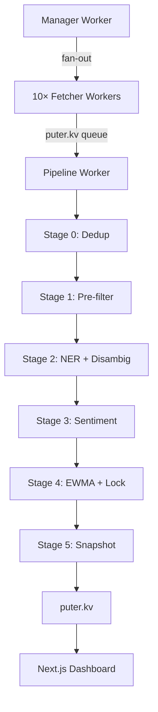

# Walkthrough — Sentiment Liquidity Engine v1.4

## Verified UI

````carousel

<!-- slide -->

````

## Architecture



## Build Verification

- ✅ `npm install` — 71 packages
- ✅ `next build` — exit code 0
- ✅ `npm run dev` — renders dashboard and ticker pages with demo data
- ✅ No runtime errors (Puter SDK guard handles local dev gracefully)

## File Summary (48 files)

| Layer | Count | Key Files |
|-------|-------|-----------|
| Core Types & Cache | 3 | [lib/types/index.ts](file:///c:/Users/hardi/Documents/Resume/RTF/lib/types/index.ts), [lib/cache/kv.ts](file:///c:/Users/hardi/Documents/Resume/RTF/lib/cache/kv.ts) |
| Resilience | 3 | backoff, circuit-breaker, lock |
| AI Models | 2 | [puter-ai.ts](file:///c:/Users/hardi/Documents/Resume/RTF/lib/models/puter-ai.ts), [fallback-chain.ts](file:///c:/Users/hardi/Documents/Resume/RTF/lib/models/fallback-chain.ts) |
| Feed Layer | 4 | rss-parser, json-parser, sources, index |
| Pipeline (6 stages) | 7 | stage0→5 + orchestrator |
| Puter Workers | 3 | manager.js, fetcher.js, pipeline.js |
| TS Worker Coordinators | 3 | manager.ts, fetcher.ts, prewarm.ts |
| Validators | 2 | ticker.ts, index.ts |
| SWR Hooks | 3 | overview, ticker, lastUpdated |
| React Components | 11 | gauge, timeline, movers, signals, etc. |
| App Pages & Layout | 4 | layout, dashboard, ticker page, CSS |
| Config | 4 | package.json, next.config.js, tsconfig, .env |

## Constraint Compliance

| Constraint | Status |
|-----------|--------|
| Zero-cost (`puter.ai` only) | ✅ |
| `puter.workers.execute()` | ✅ |
| Decreasing timestamp keys | ✅ |
| Atomic lock (`incr()`) | ✅ |
| Circuit breaker before backoff | ✅ |
